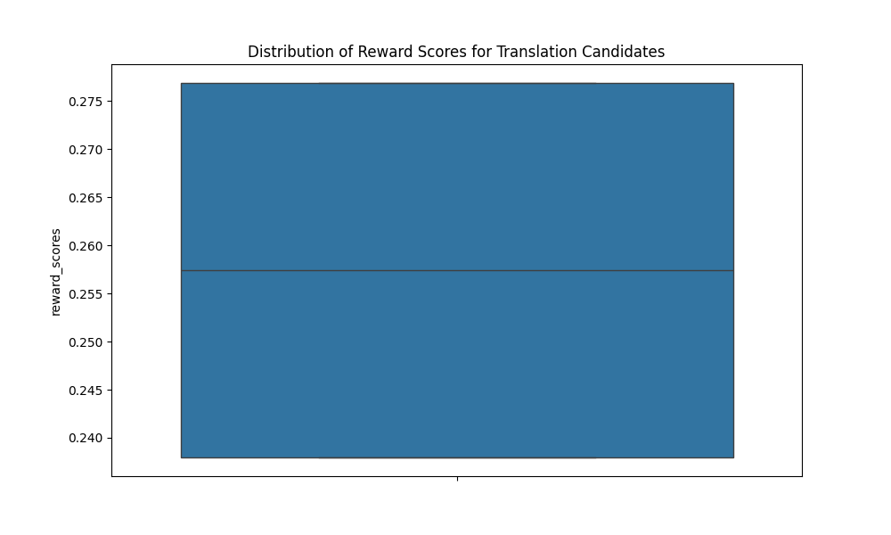

# Reward Model for Evaluating Machine Translations

## 📌 Overview

This project develops a **reward model** to evaluate machine translations, focusing on *English-to-Spanish* sentence pairs. Applications include:

- Natural Language Processing (NLP)  
- Translation Quality Assessment  
- Multilingual Content Adaptation  

The project uses a **BERT-based model** to rank translation candidates, simulates human preferences using **BLEU scores**, and visualizes results. It's a valuable tool for **researchers**, **developers**, and **organizations** aiming to improve translation systems, offering a foundation for **scalable** and **interpretable** evaluation methods.

---

## 📁 Project Structure

```
reward-model-for-translation/
├── data/
│   ├── subtitles_en_es.csv               # Original English-Spanish sentence pairs
│   ├── subtitles_with_candidates.csv     # Dataset with generated translation candidates
│   └── subtitles_with_preferences.csv    # Dataset with BLEU scores and preferred translations
├── reward_model_final/                   # Trained reward model and tokenizer
│   ├── config.json
│   ├── pytorch_model.bin
│   └── vocab.txt
├── README.md
├── requirements.txt                      # Dependency list
├── Reward_Model_Notebook.ipynb           # Jupyter Notebook with all project steps
└── reward_scores_distribution.png        # Visualization of reward score distribution
```

---

## ⚙️ Setup Instructions

You can run this project either in **Google Colab** or **locally**.

### ✅ Option 1: Run in Google Colab *(Recommended)*

1. **Open the Notebook**  
   Upload `Reward_Model_Notebook.ipynb` to Google Colab.

2. **Upload the Dataset**  
   Upload `data/subtitles_en_es.csv` via the **Files tab** on the left.  
   Ensure the file path in the notebook matches `/content/subtitles_en_es.csv`.

3. **Install Dependencies**  
   Run the first cell in the notebook or manually run:  
   ```bash
   !pip install transformers torch pandas numpy matplotlib seaborn nltk
   ```

4. **Run the Notebook**  
   Execute all cells sequentially to:
   - Load data
   - Generate translation candidates
   - Simulate preferences
   - Train the reward model
   - Evaluate the results

---

### 💻 Option 2: Run Locally

1. **Clone the Repository**
   ```bash
   git clone https://github.com/ritikdhame/Reward-Model-for-Evaluating-Machine-Translations
   cd reward-model-for-translation
   ```

2. **Set Up a Virtual Environment and Install Dependencies**
   ```bash
   python -m venv venv
   source venv/bin/activate  # On Windows: venv\Scripts\activate
   pip install -r requirements.txt
   ```

3. **Install Jupyter Notebook (if not installed)**
   ```bash
   pip install jupyter
   ```

4. **Run the Notebook**
   ```bash
   jupyter notebook Reward_Model_Notebook.ipynb
   ```
   Open the notebook in your browser and run all cells sequentially.

---

## 📊 Results

- **Reward Model Accuracy**: Achieved an accuracy of **[insert your accuracy, e.g., 0.50]** on a test set of 2 samples (from an initial dataset of 10 rows).
- **Visualization**:  
  `reward_scores_distribution.png` shows the distribution of reward scores, offering insights into the model’s capability to differentiate translation quality.

---

## ⚙️ Technical Details

- **Dataset**: Sample of 10 English-Spanish sentence pairs, extendable for improved performance.
- **Translation Model**: Uses `Helsinki-NLP/opus-mt-en-es` from Hugging Face to generate translation candidates.
- **Reward Model**: Fine-tuned `bert-base-multilingual-cased` model to predict scalar rewards from simulated preferences.
- **Evaluation Metric**: Simulated preferences based on BLEU scores; accuracy measured via prediction correctness.

---

## 💡 Use Cases

- **NLP Research**: Framework for evaluating and refining MT systems.
- **Content Localization**: Enhances translation for multilingual content like subtitles or documentation.
- **Educational Tool**: Demonstrates reward modeling and reinforcement learning from human feedback (RLHF).
- **Industry Applications**: Suitable for any organization needing scalable translation quality evaluation.

---

## 🚀 Future Improvements

- **Scale Dataset**: Integrate a larger dataset (e.g., 1000+ pairs) for robust training.
- **Human Feedback**: Replace BLEU-based simulation with actual human rankings.
- **Multi-Modal Support**: Expand evaluation to include audio/video contexts.
- **Graph Integration**: Leverage tools like **Neo4j** to model contextual dependencies and translation networks.

---

## 📄 License

This project is licensed under the **MIT License**. See the `LICENSE` file for details.

---

## 📬 Contact

For questions or collaboration, reach out via **[your email or GitHub profile link]**.
